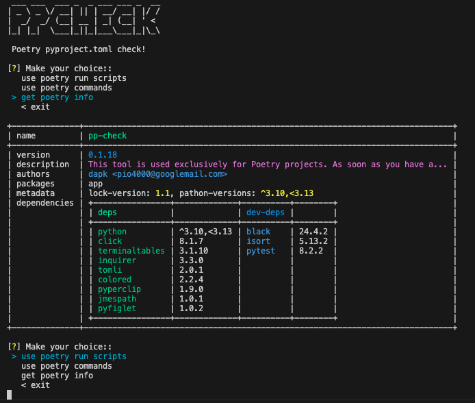
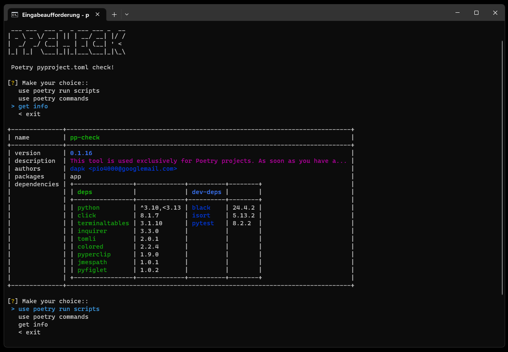

# 🔍 pp-check

> A Poetry project inspection tool — quickly discover available scripts, dependencies, and project metadata right from your terminal.

## Features

- **Script Browser** — interactive menu to list and run Poetry scripts
- **Copy to Clipboard** — one-click copy of script commands
- **Project Info** — display name, version, description, authors, and packages
- **Dependency Overview** — side-by-side view of production and dev dependencies
- **CLI & Poetry Integration** — run as a Poetry command or standalone CLI tool

## Requirements

| Dependency     | Minimum Version |
|----------------|-----------------|
| Poetry         | >= 1.2.0        |
| Python         | >= 3.10         |

## Installation

### Via PyPI

```bash
pip install pp-check
```

### Via Poetry (local development)

```bash
poetry update
poetry install
```

### As a system CLI command

```bash
sh ./cli_install_bash.sh
```

## Usage

### As a Poetry command

```bash
poetry run ppcheck .
```

This will present an interactive menu listing all scripts defined in `[tool.poetry.scripts]` from your `pyproject.toml`.

### As a standalone CLI command

```bash
ppcheck .
```

### Options

```
poetry run ppcheck --help

Usage: ppcheck [OPTIONS] CHECK_POETRY_PATH

  This tool is used exclusively for Poetry projects. As soon as you have a
  poetry project in front of you in the console, you can use this tool to
  quickly find out which script commands the poetry project contains.

  usage: set path of poetry project, e.g.

  $ poetry run ppcheck ~/poetry-project

Options:
  --help  Show this message and exit.
```

## Interactive Menu

When you run `ppcheck`, you'll be guided through a two-level menu:

1. **Select a script** — Choose from all available Poetry scripts
2. **Choose an action**:
   - `> show --help` — Display the script's help output
   - `> copy command to clipboard` — Copy the command for later use
   - `< back` — Return to script selection
   - `< exit` — Exit the tool

## Screenshots

| Platform  | Preview |
|-----------|---------|
| macOS     |  |
| Windows   |  |

## Development

### Install dependencies

```bash
poetry install
```

### Run tests

```bash
poetry run pytest
```

### Format code

```bash
poetry run black .
poetry run isort .
```

## Project Structure

```
pp-check/
├── app/
│   ├── ppcheck.py              # CLI entry point
│   └── libs/
│       ├── cls.py              # Poetry command constants
│       ├── func.py             # Utility functions (script menu, exec, clipboard)
│       └── ppinfo.py           # Project info extraction & display
├── res/
│   ├── mac2.png                # macOS screenshot
│   └── win.png                 # Windows screenshot
├── scripts/
│   ├── build.sh                # Build script
│   ├── release.sh              # Release script
│   └── tag.sh                  # Tag script
├── tests/
│   └── test_*.py               # Test suite
├── pyproject.toml
├── poetry.lock
└── README.md
```

## License

[MIT](LICENSE)